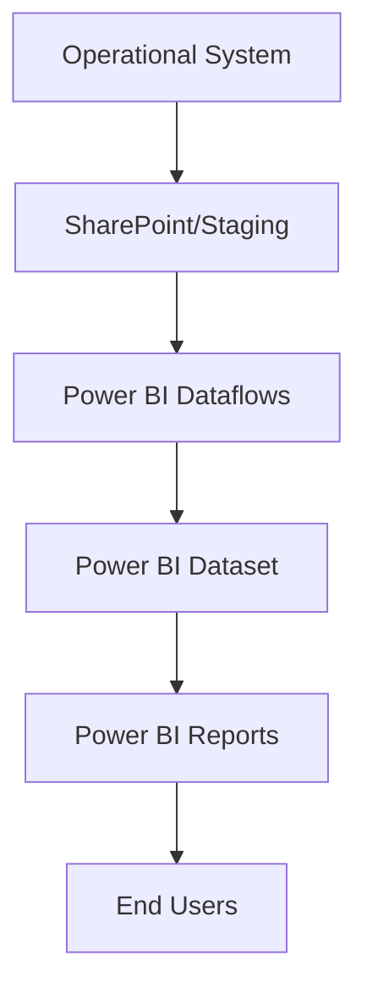

---


# {{title}} - Power BI Project Documentation

> [!NOTE] Living Document
> This design document is a **living document** that will be updated throughout the design, testing, and production use periods. Increment the version with each iteration and maintain version control.

## Document Control

| Item | Details |
|------|---------|
| **Document Title** | {{title}} - Power BI Design Document |
| **Version** | V0.1 |
| **Version Date** | {{date}} |
| **Author** | [Developer Name] |
| **Business Owner** | [Business Owner Name] |
| **Status** | Draft/In Development/Under Review/Approved |

---

## 1. General Information

### 1.1 Identification
- **Project Title**: [Clear, descriptive project name]
- **Report ID(s)**: [Unique identifier(s) for each report]
- **Version**: [Current version number]
- **Version Date**: [Date of current version]
- **Document Location**: [SharePoint/Teams/Common accessible location]

### 1.2 Version History

| Version | Date | Author | Description of Changes |
|---------|------|--------|----------------------|
| V0.1 | {{date}} | [Author] | Initial draft |
| | | | |

### 1.3 Terminology & Definitions

| Term | Definition |
|------|------------|
| [Business Term 1] | [Clear definition for stakeholder alignment] |
| [Business Term 2] | [Clear definition for stakeholder alignment] |
| [Technical Term 1] | [Technical definition] |

> [!TIP] Why This Matters
> Different organizations often have unique understandings for rules, definitions, or filters. Document these to ensure all team members use the same understanding and avoid **unforced errors**.

### 1.4 Table of Contents
*Enable navigation pane in document for easy navigation*

### 1.5 Introduction
**High-level project description including:**
- Major features and functionality
- Target audience and security requirements
- Performance expectations
- Business value and expected outcomes

*Example: The project will produce 4 Power BI reports to monitor the invoicing process. Data will be extracted automatically from the corporate invoicing system and refreshed daily. Reports will be accessible to internal corporate users only with role-based security.*

---

## 2. Scope Definition

> [!IMPORTANT] Scope Control
> Be brutal with scope: include only what is essential, exclude all that you can (be specific!), and defer whatever you can. **"If everything is a priority, then nothing is a priority"**

### 2.1 Reports Overview

| ID | Name | Description | Audience/Security |
|----|------|-------------|-------------------|
| R01 | [Report Name] | [High-level description] | A=[Audience] / S=[Security notes] |
| R02 | [Report Name] | [High-level description] | A=[Audience] / S=[Security notes] |

### 2.2 Included Scope Items

| ID | Included Item | Description/Reason |
|----|---------------|-------------------|
| SI-1 | [Feature/Requirement] | [Clear description and business justification] |
| SI-2 | [Feature/Requirement] | [Clear description and business justification] |

### 2.3 Excluded Scope Items

| ID | Excluded Item | Description/Reason |
|----|---------------|-------------------|
| SE-1 | [Feature/Requirement] | [Clear description why excluded] |
| SE-2 | [Feature/Requirement] | [Clear description why excluded] |

### 2.4 Deferred Scope Items

| ID | Deferred Item | Description/Reason/Target Version |
|----|---------------|----------------------------------|
| SD-1 | [Feature/Requirement] | D=[Description] R=[Reason] V=[Target Version] |
| SD-2 | [Feature/Requirement] | D=[Description] R=[Reason] V=[Target Version] |

---

## 3. Workflow Documentation

### 3.1 Data Flow Process
*Include a simple workflow flowchart with swim lanes showing data movement from operational systems through Power BI Service*

**Step-by-step workflow:**
1. [Data extraction process and timing]
2. [Data transformation and staging]
3. [Power BI Service refresh process]
4. [End user access method]

### 3.2 Workflow Diagram


---

## 4. Issue Tracking

> [!NOTE] Issue Evolution
> Record the full decision history for each status level. **Append, don't edit** - this creates a clear audit trail.

### 4.1 Current Issues

| ID | Name | Description | Status/History |
|----|------|-------------|----------------|
| I-1 | [Issue Name] | [Detailed description] | NEW ({{date}}): [Initial status and owner] |
| I-2 | [Issue Name] | [Detailed description] | IN PROGRESS ({{date}}): [Update and responsible party] |

### 4.2 Resolved Issues

| ID | Name | Description | Resolution |
|----|------|-------------|------------|
| I-R1 | [Issue Name] | [Description] | RESOLVED (Date): [Resolution details] |

---

## 5. Business Rules Documentation

> [!WARNING] Business Rules Critical
> Business rules are not universal. Document every rule to ensure developers, testers, and users are measuring the same thing.

### 5.1 Active Business Rules

| ID | Rule Name | Description | Status/Approval |
|----|-----------|-------------|-----------------|
| BR-1 | [Rule Name] | [Detailed definition with specific criteria] | APPROVED (Date): [Approver name and details] |
| BR-2 | [Rule Name] | [Detailed definition with specific criteria] | DRAFT (Date): [Current status] |

### 5.2 Calculation Definitions

| ID | Calculation | Formula/Logic | Business Context |
|----|-------------|---------------|------------------|
| C-1 | [KPI/Measure Name] | [Exact formula or business logic] | [When/how this is used] |
| C-2 | [KPI/Measure Name] | [Exact formula or business logic] | [When/how this is used] |

---

## 6. Data Architecture

### 6.1 Environments

| Environment | Purpose | Data Characteristics | Access |
|-------------|---------|---------------------|--------|
| DEV | Development | [Volume, refresh, security] | [Who has access] |
| TEST | User Acceptance | [Representative of PROD?] | [Who has access] |
| PROD | Production | [Full volume, real security] | [Who has access] |

> [!QUOTE] Testing Reality
> "Everybody has a TEST environment; some are lucky enough to also have a PROD environment"

### 6.2 Data Sources

| ID | Name | Description | Status/Access |
|----|------|-------------|---------------|
| S-1 | [Source System] | [System description and data type] | [Status, credentials, gateway info] |
| S-2 | [Source System] | [System description and data type] | [Status, credentials, gateway info] |

### 6.3 Data Volume & Refresh Strategy

| ID | Data Source | Volume Strategy | Refresh Frequency |
|----|-------------|-----------------|-------------------|
| V-1 | [Source] | [Filters and aggregations applied] | [Frequency and timing] |
| V-2 | [Source] | [Filters and aggregations applied] | [Frequency and timing] |

> [!TIP] Volume Optimization
> **"Reduce data volume as much as possible by aggregating as far upstream as possible"**
> 
> **"There is no benefit in transferring data you're not going to use"**

### 6.4 Semantic Model Design

#### 6.4.1 Model Diagram
*Include image of data model arranged for clarity (waterfall design: dimensions at top, facts in middle, supporting tables bottom-left, measures top-right)*

#### 6.4.2 Model Relationships

| ID | From Table[Column] | To Table[Column] | Cardinality | Direction |
|----|-------------------|------------------|-------------|-----------|
| CR-1 | Dates[Date] | Sales[Date] | One-to-Many | Single |
| CR-2 | Customers[ID] | Sales[CustomerID] | One-to-Many | Single |

---

## 7. Report Design Standards

### 7.1 Common Design Elements

#### 7.1.1 Theme Specifications

| Element | Specification | Notes |
|---------|--------------|-------|
| **Page Size** | Desktop: 1600x900 pixels | Standard widescreen |
| **Colors Main** | [Hex codes for primary palette] | Based on corporate theme |
| **Colors Sentiment** | Green (#3BB44A), Yellow (#F2C811), Red (#E81123) | Stoplight system |
| **Fonts** | Segoe UI family with specific sizes | Consistent across reports |

#### 7.1.2 Navigation Standards
- **Primary Method**: Power BI App (preferred for multi-report navigation)
- **Backup Method**: [If standalone navigation needed]
- **Page Structure**: Header with title and navigation, footer with version info

#### 7.1.3 Standard Components
**Page Header Elements:**
- Report title
- Navigation menu
- Last refresh date
- Filter selections display

**Page Footer Elements:**
- Company logo
- Report ID/Version
- Dataset ID/Version

### 7.2 Report-Specific Design

#### 7.2.1 [Report Name 1]
**Purpose**: [What questions does this report answer?]

**Filters Applied**:
- [Filter 1]: [Description]
- [Filter 2]: [Description]

**Key Visuals**:
- [Visual Type]: [Description and purpose]
- [Visual Type]: [Description and purpose]

**KPIs/Measures**:
- [KPI Name]: [Definition and purpose]
- [KPI Name]: [Definition and purpose]

---

## 8. Testing & Validation

### 8.1 Automated Testing Implementation

> [!TIP] DAX Query View Testing
> Implement automated testing using DAX Query View with reference Excel file containing expected values and acceptance criteria.

#### 8.1.1 Test Categories Implemented
- [ ] **Data Quality Tests**: Row counts, distinct values, null checks
- [ ] **Referential Integrity Tests**: Relationship validation, orphaned records
- [ ] **Calculation Consistency Tests**: Cross-validation of measures
- [ ] **Business Rule Tests**: Validation against documented business rules
- [ ] **Historical Comparison Tests**: Trend validation and bounds checking

#### 8.1.2 Test Execution Process
1. **Create Reference Excel**: Document expected values with business owner
2. **Import to Power BI**: Include as disconnected validation table
3. **Create DAX Tests**: Automated validation queries in DAX Query View
4. **Execute & Document**: Run tests and record results

### 8.2 Manual Validation Plan

| Test ID | Test Name | Expected Result | Tolerance | Status |
|---------|-----------|----------------|-----------|---------|
| T-1 | [Test Description] | [Expected Value] | [Acceptable Variance] | [Pass/Fail] |
| T-2 | [Test Description] | [Expected Value] | [Acceptable Variance] | [Pass/Fail] |

### 8.3 Acceptance Criteria

> [!IMPORTANT] Definition of Done
> Document specific, measurable criteria that must be met before deployment.

#### 8.3.1 Functional Requirements
- [ ] All KPIs match source system calculations
- [ ] All visuals respond correctly to filters
- [ ] Navigation works across all pages
- [ ] Security restricts access appropriately

#### 8.3.2 Performance Requirements
- [ ] Page load time < 3 seconds
- [ ] Filter response time < 2 seconds
- [ ] Dataset refresh completes within SLA

#### 8.3.3 Quality Requirements
- [ ] All automated tests pass
- [ ] Best Practice Analyzer shows no critical issues
- [ ] User acceptance testing completed
- [ ] Documentation complete and approved

---

## 9. Deployment Strategy

### 9.1 Deployment Parameters

| ID | Parameter | DEV | TEST | PROD |
|----|-----------|-----|------|------|
| P-1 | [Data Source Path] | [DEV Path] | [TEST Path] | [PROD Path] |
| P-2 | [Connection String] | [DEV Connection] | [TEST Connection] | [PROD Connection] |

### 9.2 Deployment Procedure

| ID | Step | Notes | Value | Completion |
|----|------|-------|-------|------------|
| S-1 | Environment Verification | [Target environment] | [PROD] | Date/By: [Name] |
| S-2 | Data Publishing | [Ensure target data available] | [Details] | Date/By: [Name] |
| S-3 | Artifact Publishing | [PBIX to workspace] | [Report names] | Date/By: [Name] |
| S-4 | Parameter Configuration | [Set environment parameters] | [Values] | Date/By: [Name] |
| S-5 | Security Verification | [Workspace and report access] | [Confirmed] | Date/By: [Name] |
| S-6 | Refresh Verification | [Manual refresh test] | [Success] | Date/By: [Name] |
| S-7 | Schedule Configuration | [Set refresh schedule] | [Timing] | Date/By: [Name] |
| S-8 | Smoke Testing | [Basic functionality verification] | [Passed] | Date/By: [Name] |

---

## 10. Model Documentation (Implementation)

### 10.1 Tables & Columns

> [!NOTE] INFO Functions
> Use DAX INFO VIEW functions to extract actual implementation details:
> ```dax
> EVALUATE INFO.VIEW.TABLES()
> EVALUATE INFO.VIEW.COLUMNS()
> EVALUATE INFO.VIEW.RELATIONSHIPS()
> EVALUATE INFO.VIEW.MEASURES()
> ```

#### 10.1.1 Fact Tables
**[Table Name]**
| Column | Type | Sample | Notes |
|--------|------|--------|-------|
| [Column] | [Data Type] | [Sample Value] | [Key/Foreign Key info] |

#### 10.1.2 Dimension Tables
**[Table Name]**
| Column | Type | Sample | Notes |
|--------|------|--------|-------|
| [Column] | [Data Type] | [Sample Value] | [Key info] |

#### 10.1.3 Supporting Tables
**[Table Name]** - [Purpose/Description]
| Column | Type | DAX Expression | Notes |
|--------|------|----------------|-------|
| [Column] | [Type] | [Formula if calculated] | [Description] |

### 10.2 Relationships (Actual Implementation)

| ID | From | To | Cardinality | Direction | Status |
|----|------|----|-----------  |-----------|--------|
| CR-1 | [Table[Column]] | [Table[Column]] | [One-to-Many] | [Single] | [Active] |

### 10.3 Measures Documentation

> [!TIP] Measure Formatting
> Use Tabular Editor to format all measures:
> ```csharp
> Model.AllMeasures.FormatDax();
> ```

**Key Measures:**
```dax
[Measure Name] = 
    [DAX Expression with proper formatting]
    
[Another Measure] = 
    [DAX Expression]
```

---

## 11. User Adoption & Onboarding

### 11.1 User Confidence Requirements

> [!NOTE] Essential User Questions
> Address these unspoken but critical questions users have:
> - ✅ Is the data up to date?
> - ✅ Is the report trustworthy and ready to use?
> - ✅ How does this report help me?
> - ✅ What if I run into issues?
> - ✅ Where can I get help or training?
> - ✅ Who owns and maintains this report?

### 11.2 Onboarding Strategy

#### 11.2.1 Success Metrics
**Adoption Measures:**
- Active user count and growth
- Feature utilization rates
- User satisfaction scores
- Self-service success rates

**Impact Measures:**
- Business KPI improvements
- Decision-making speed
- Process efficiency gains
- Data-driven behavior changes

#### 11.2.2 Support Materials
- [ ] **Info Buttons**: Contextual help embedded in reports
- [ ] **What's New** notifications for updates
- [ ] **Release Page**: Roadmap and change communication
- [ ] **Feedback Collection**: Direct input mechanisms
- [ ] **Training Materials**: Videos, guides, and documentation

### 11.3 Feedback Integration
- **Collection Method**: [Power BI App embedded forms/Teams channel]
- **Review Frequency**: [Weekly/Monthly]
- **Response Process**: [How feedback is acknowledged and acted upon]

---

## 12. Monitoring & Maintenance

### 12.1 Performance Monitoring
- **Key Metrics**: [Load times, usage patterns, error rates]
- **Monitoring Tools**: [DAX Studio, Performance Analyzer, Usage Metrics]
- **Review Schedule**: [Weekly/Monthly performance reviews]

### 12.2 Data Quality Monitoring
- **Automated Checks**: [Daily/Weekly validation runs]
- **Issue Detection**: [Alert thresholds and notification methods]
- **Resolution Process**: [Escalation paths and fix procedures]

### 12.3 Maintenance Schedule
- **Regular Updates**: [Documentation, testing, performance optimization]
- **Version Control**: [Change management and approval process]
- **Backup Strategy**: [Report backups and recovery procedures]

---

## 13. Advanced Features (If Applicable)

### 13.1 Translytical Task Flows

> [!WARNING] Action-Enabled Analytics
> When reports can execute real actions, documentation becomes business-critical for operational safety.

#### 13.1.1 Function Documentation
**[Function Name]:**
- **Purpose**: [What business problem it solves]
- **Trigger Conditions**: [When this function executes]
- **Input Parameters**: [Required data and validation rules]
- **Business Logic**: [What the function does]
- **System Impact**: [What systems are affected]
- **Error Handling**: [How errors are managed]
- **Rollback Plan**: [How to undo if necessary]

#### 13.1.2 Security & Permissions
- **Execution Rights**: [Who can trigger this function]
- **Approval Requirements**: [What approvals are needed]
- **Audit Trail**: [How actions are logged and tracked]
- **Risk Mitigation**: [Safeguards and monitoring]

---

## 14. External Tools Integration

### 14.1 Development Tools
- **Tabular Editor**: [Scripts used, BPA rules applied]
- **DAX Studio**: [Performance analysis, testing procedures]
- **Measure Killer**: [Cleanup and optimization activities]

### 14.2 Documentation Tools
- **Version Control**: [Git/DevOps integration]
- **Collaboration**: [Teams/SharePoint for stakeholder access]
- **Knowledge Management**: [Obsidian/Wiki for cross-referencing]

---

## Cross-References & Links

### Related Documentation
- [[Requirements Template - Power BI Report]]
- [[Requirements Template - Power BI Environment]]
- [[DAX Best Practices]]
- [[Testing Procedures]]
- [[Deployment Checklist]]

### External Resources
- [Microsoft Power BI Documentation](https://docs.microsoft.com/power-bi/)
- [DAX Guide](https://dax.guide/)
- [Power BI Community](https://community.powerbi.com/)

---

## Tags & Classification

#powerbi #documentation #design-document #data-model #business-intelligence #project/{{title}} #status/in-progress

---

## Document Review

| Review Type | Reviewer | Date | Status | Comments |
|-------------|----------|------|--------|----------|
| Technical Review | [Developer] | [Date] | [Pending/Complete] | [Comments] |
| Business Review | [Business Owner] | [Date] | [Pending/Complete] | [Comments] |
| Final Approval | [Project Manager] | [Date] | [Pending/Complete] | [Comments] |

---

*Document Version: {{version}} | Last Updated: {{date}} | Next Review: [Date]*

> [!SUCCESS] Living Documentation
> Remember: This document should evolve with your project. Update version numbers, track changes, and maintain accuracy throughout the project lifecycle. **When we finalize documentation, we document excellence.**
